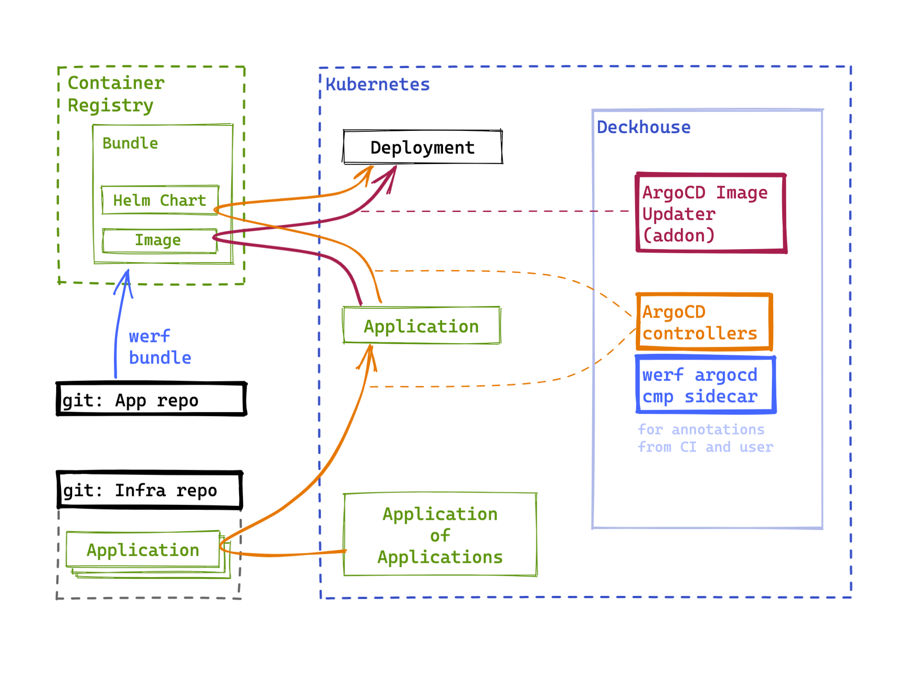

- [Аутентификация CLI](#аутентификация-cli)
- [werf bundle и ArgoCD image updater](#werf-bundle-и-argocd-image-updater)
  - [Концепция](#концепция)
  - [Обозначения](#обозначения)
  - [Доступ к регистри](#доступ-к-регистри)
  - [Публикацичя бандла в registry](#публикацичя-бандла-в-registry)
  - [Деплой](#деплой)
  - [Автообновление бандла](#автообновление-бандла)
    - [Правила обновлений образов](#правила-обновлений-образов)
    - [Настройки доступа к registry](#настройки-доступа-к-registry)
      - [Индивидуальная настройка для Application](#индивидуальная-настройка-для-application)
      - [Глобальные настройки](#глобальные-настройки)

## Аутентификация CLI

Командная утилита `argocd` необязательна для того, чтобы пользоваться модулем. Чтобы ею
пользоваться, нужно авторизовать ее для инсталляции ArgoCD.

Доступные варианты:

1. username+password из конфигурации ArgoCD или для пользователя admin (по умолчанию выключен).
2. Через kubectl, настроен внешний доступ к Kubernetes API (TODO ссыль на user-authn/publishAPI)
   ```sh
   argocd login argocd.<publicDomainTemplate> --core
   ```

Недоступные варианты:

Через Dex авторизация не работает для CLI, хотя работает в веб-интерфейсе.

```sh
argocd login argocd.<publicDomainTemplate> --sso
```

## werf bundle и ArgoCD image updater

### Концепция

В этой схеме используется связка werf bundle (TODO: ссыль) и OCI-chart (TODO: ссыль).

werf используется для continous delivery: в OCI-регистри публикуется бандл, который содержит как все
образы контейнеров, так и Helm-чарт. ArgoCD использует регистри как репозиторий: синхронизирует
состояние чарта в кластере. В добавок используется ArgoCD Image Updater, который обновляет чарт в
кластере, когда публикуется новая версия.



В данной схеме изображена схема с паттерном «Application of Applications» (TODO ссыль),
подразумевающая разные git-репозитории для приложения и инфраструктуры. Инфраструктурный
git-репозиторий необязателен, если допускается создавать ресусры Application вручную. Далее мы будем
придерживаться ручного управления ресурсами Application.

### Обозначения

Данные, которые используются в примерах ниже:

- `APP_NAME=myapp` — название приложения.
- `CHART_NAME=mychart` — название Helm-чарта и werf-бандла, в этой схеме они должны
  совпадать. Для явности мы выбрали это название отличным от названия приложения.
- `REGISTRY_HOST=cr.example.com` — хостнейм OCI-регистри.
- `REGISTRY_REPO=cr.example.com/myproject` — репозиторий бандла в OCI-регистри.

### Доступ к регистри

Регистри играет роль репозитория бандлов. Этот регистри нужно добавить в ArgoCD через командную
утилиту `argocd`, так как в нем не поддерживается флаг `--enable-oci`. Благодаря этому флагу
ArgoCD не будет восринимать регистри как Chart Museum.

#### Настройка через веб-интерфейс и kubectl

Если создать Helm-репозиторий в веб-интерфейсе, то для него будет создан секрет с конфигурацией.
Однако веб-интерфейс не позволяет установить флаг `enableOCI`, поэтому его нужно добавить вручную:

```sh
kubectl -n d8-delivery edit secret repo-....
```

```yaml
apiVersion: v1
kind: Secret
stringData:           # <----- добавить
  enableOCI: "true"   # <----- и сохранить
data:
  # (...)
metadata:
  # (...)
  name: repo-....
  namespace: d8-delivery
type: Opaque
```
#### Настройка через CLI

Утилита `argocd` [не позволяет указывать namespace](https://github.com/argoproj/argo-cd/issues/9123)
во время вызова и рассчитывает на namespace `argocd`. Модуль с ArgoCD в Deckhouse находится в
namespace `d8-delivery`. Поэтому namespace `d8-delivery` нужно назначить по умолчанию в kubectl,
чтобы подключаться к ArgoCD:

```sh
# временно переключите namespace по умолчанию
$ kubectl config set-context --current --namespace=d8-delivery

# создайте конфигурацию репозитория для бандлов
$ argocd repo add cr.example.com/myproject \
  --enable-oci \
  --type helm \
  --name REPO_NAME \
  --username USERNAME \
  --password PASSWORD
```


### Публикацичя бандла в registry

OCI-чарт хельма требует, чтобы `Chart.yaml::Name` обязательно совпадал с последним элементом пути в
OCI-registry. Поэтому название чарта нужно использовать в названии бандла:

```sh
werf bundle publish --repo cr.example.com/myproject/mychart --tag 1.2.3
```

Подробнее о бандлах — в документации werf. (TODO: дока на верфь)

### Деплой

Создайте Application c нужными значениями для чарта.

```yaml
apiVersion: argoproj.io/v1alpha1
kind: Application
metadata:
  # Используйте название ресурса на ваше усмотрение:
  name: myapp
  namespace: d8-delivery
spec:
  destination:
    # Используйте namespace на ваше усмотрение:
    namespace: myapp
    server: https://kubernetes.default.svc
  # Для простоты в этом примере используем проект default
  project: default
  source:
    chart: mychart
    repoURL: cr.example.com/myproject
    targetRevision: 1.2.3
    helm:
      # Переопределение Helm values:
      parameters:
        - name: redis.storage.class
          value: rbd
        - name: http.domain
          value: myapp-api.example.com
  syncPolicy:
    syncOptions:
      - CreateNamespace=true
```

### Автообновление бандла

ArgoCD Image Updater используется для автоматического обновления Application из опубликованного
werf-бандла в pull-модели. Это приложение сканирует OCI-репозиторий с заданным интервалом и
обновляет `targetRevision` в Application, посредством чего обновляется все приложение. Мы используем
пропатченный форк Image Updater, который умеет работать с OCI-регистри, и, соответственно, с
werf-бандлами.

#### Правила обновлений образов

В Application нужно добавить аннотацию с правилами обновления образа. (TODO ссыль на доку с
правилами) Пример правила, обновляющие патч-версии приложения `1.0.*`:

```yaml
apiVersion: argoproj.io/v1alpha1
kind: Application
metadata:
  annotations:
    argocd-image-updater.argoproj.io/chart-version: ~ 1.0
```

#### Настройки доступа к registry

У сервисаккаунта `argocd-image-updater` есть права работу ресурсами только в неймспейсе
`d8-delivery`, поэтому именно в нем необходимо создать секрет с параметрами доступа к регистри, на
который ссылается поле `credetials`.

##### Индивидуальная настройка для Application

Сослаться на параметры доступа можно индивидуально в каждом Application с помощью аннотации:

```yaml
apiVersion: argoproj.io/v1alpha1
kind: Application
metadata:
  annotations:
    argocd-image-updater.argoproj.io/chart-version: ~ 1.0
    argocd-image-updater.argoproj.io/pull-secret: pullsecret:d8-delivery/myregistry-credentials
```

##### Глобальные настройки

Можно задать параметр доступа в глобальном когфиге, чтобы не определять их в Application по
отдельности. Для этого нужно отредактировать ConfigMap `d8-delivery/argocd-image-updater-config`
согласно
[документации](https://argocd-image-updater.readthedocs.io/en/stable/configuration/registries/#supported-registries).

```yaml
apiVersion: v1
kind: ConfigMap
metadata:
  # (...)
  name: argocd-image-updater-config
  namespace: d8-delivery
data:
  registries.conf: |
    registries:
      - name: My registry
        prefix: cr.example.com
        api_url: https://cr.example.com
        credentials: pullsecret:d8-delivery/myregistry-credentials
```
